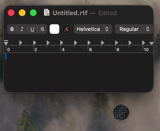

```
▓███▓▓▓▓████████████████████████████████████████████████████▓██████▓▓▓▓▓▓█
██████▓▒▒▒▓▒▒░░    ░░    _____             __        ░       ▒▒▓▒▒▓▓▓▓████
█████▓▓▒▓▓▓▒░     ░░░   / ___/____  ____  / /_____  ░░      ░▒▓▒▒▒▓▓▓█████
███▓█▓▓▓▓▓▒░ ░░░  ░░    \__ \/ __ \/ __ \/ //_/ _ \ ░      ░▒▒▒▒▒▒▓▓██████
██▓███▓▓▓▓▒░░░░░       ___/ / /_/ / /_/ / ,< /  __/       ░░▒▒░░▒▓▓███████
██████▓▓▒▒░░░▒░       /____/ .___/\____/_/|_|\___/      ░   ░░░░▒▓▓▓▓▓████
█████▓▒▒▒▒░▒▒▒░           /_/                          ░     ░░▒▓▓▓▒▒▓████
▓▓▓▓▓█████▓▓▓███████████████████████████████████████████████████▓▓▓▓████▓▓
                                          
```

 [](https://github.com/FlyvendeMus/Spoke/releases/latest) [](https://rainhexer.space/donate)

**Talk instead of type.** Hold a hotkey, speak, release — your words appear wherever your cursor is. Any app, any text field, on **Linux**, **macOS** and **Windows**.

## How it works

1. **Hold the hotkey** (default: `Cmd+Shift+S` on Mac, `Ctrl+Alt+Space` elsewhere) — the microphone opens.
2. **Speak.**
3. **Release** — moments later your words are typed into whatever has focus.

Prefer tap-to-start / tap-to-stop? Switch to **Toggle** mode. Prefer the text on your clipboard? Turn on **Copy to clipboard**.

## In action

<table>
  <tr>
    <td align="center"><br>Dictating into a text editor</td>
    <td align="center"><br>Switching models in settings</td>
  </tr>
</table>

## The bubble

The bubble is an organic and reactive indicator that lives in the corner of your screen. Its colour, shape, and animation change to reflect what Spoke is doing. Click to open the orbit-ring menu; drag to reposition.

<table>
  <tr>
    <td align="center"><br><b>Idle</b><br>Waiting for input</td>
    <td align="center"><br><b>Recording</b><br>Listening to what you are saying</td>
    <td align="center"><br><b>Transcribing</b><br>Processing your speech</td>
    <td align="center"><br><b>Warning</b><br>Something is wrong with your configuration</td>
  </tr>
</table>

## System tray

The bubble can be minimized into the system tray. The tray icon mirrors the bubble's status colours — grey for idle, red for recording, blue for processing, yellow for warning — so you always know what Spoke is doing, even when the bubble is hidden.

Right-click the tray icon for a context menu: restore the bubble, copy recent transcriptions, change the main settings (mode, model, trigger, output, language, audio saving), and quit.

Prefer the tray without the bubble entirely? A dedicated **tray-only build** compiles the window out — see [BUILD.md](BUILD.md#tray-only-build-no-bubble-window).

## Private by default

Spoke transcribes speech **on your own computer** using [Whisper](https://github.com/ggerganov/whisper.cpp). No account, no subscription, no audio leaving your machine, works completely offline.

The first time you open settings, pick a model and click **Download** — Spoke fetches it for you:

| Model | Size | Good for |
|-------|------|----------|
| tiny | 74 MB | Very old or low-power machines |
| base | 141 MB | Fast, decent accuracy |
| small | 465 MB | Balanced |
| medium | 1.4 GB | Better accuracy, more RAM |
| large-v3-turbo | 1.5 GB | Best accuracy — the default |
| large-v3 | 2.9 GB | Maximum accuracy |

If you'd rather use a cloud service, switch **Mode** to *Online* and paste a Google Cloud Speech-to-Text API key. Online mode is faster on weak hardware but sends audio to Google.

## Fast on every machine

Spoke uses whatever your hardware is best at. Each build is made for one platform and ships only what that platform needs:

| Platform | Acceleration |
|----------|-------------|
| macOS (Apple Silicon) | Neural Engine (CoreML), GPU (Metal), or CPU |
| Linux | NVIDIA GPU (CUDA), any GPU (Vulkan), or CPU |
| Windows | NVIDIA GPU (CUDA), any GPU (Vulkan), or CPU |

The engine bubble shows which one is active. Change it anytime — no reinstall, no restart.

## Get Spoke

Pre-built binaries are available on the [Releases page](https://github.com/FlyvendeMus/Spoke/releases).

To build from source, see [BUILD.md](BUILD.md). It takes one command per platform once the toolchain is installed — the build produces a normal installer (`.dmg`, `.deb`, `.rpm`, `.AppImage`, `.msi`, or `.exe`). Speech models are downloaded in-app.

## First run

- **macOS**: grant **Microphone** and **Accessibility** permissions when prompted. If rebuilding from source, re-grant both after replacing the app — each build gets a new signature.
- **Linux on Wayland**: if the hotkey doesn't respond, try `GDK_BACKEND=x11 spoke`.
- **Everywhere**: click the bubble to open settings, download a model, and you're set.

Missing a permission? The bubble pulses yellow and category bubbles carry a **!** badge — click through to see what's needed.

## Where things live

| What | macOS | Linux | Windows |
|------|-------|-------|---------|
| Settings (`spoke.toml`) | `~/Library/Application Support/spoke/` | `~/.config/spoke/` | `%APPDATA%\spoke\` |
| Downloaded models | `<config dir>/spoke/models/` | `<config dir>/spoke/models/` | `<config dir>/spoke/models/` |
| Saved recordings (optional) | `~/Documents/Spoke` | `~/Documents/Spoke` | `~/Documents\Spoke` |

## Documentation

- **[BUILD.md](BUILD.md)** — building and packaging for each platform
- **[ARCHITECTURE.md](ARCHITECTURE.md)** — how Spoke works inside
- **[SPOKE.md](SPOKE.md)** — the original product specification
